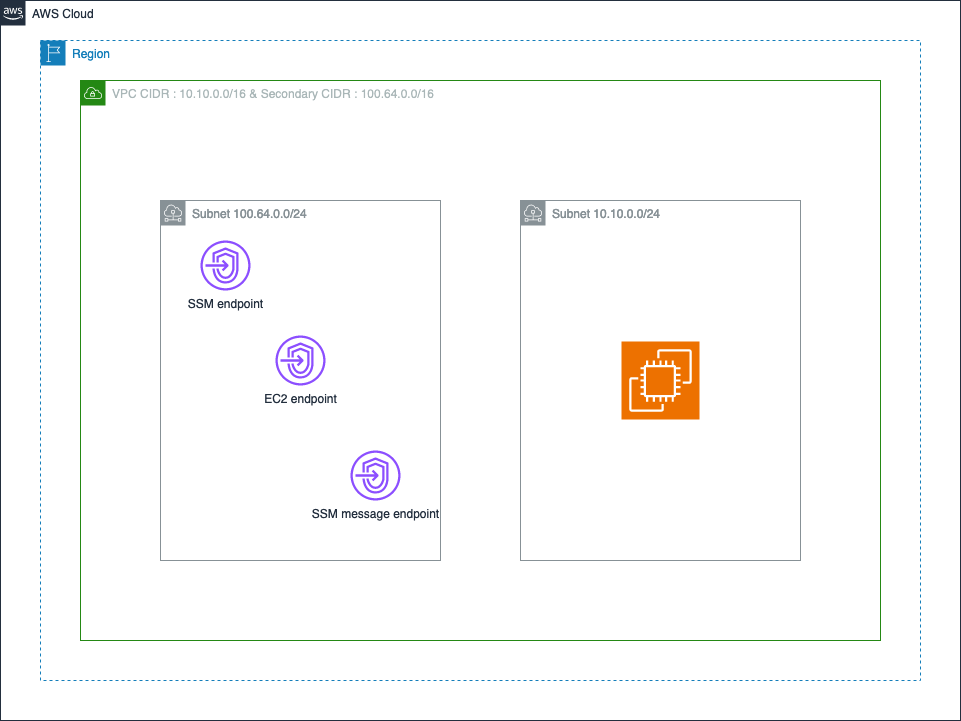

# Welcome VPC Interface endpoint example !

In this project, the goal is just to create the following Architecture, using AWS Python CDK : *Having VPC endpoints a in a secondary CIDR of the VPC*.

)

# Goal : 

We wants to create a session with Session Manager to an EC2 instance in a Private subnet using primary CIDR without Internet connectivity (no Nat, no IGW) using VPC Endpoint who are in a secondary CIDR which use the secondary CIDR. It doesn't work with the CDK L2 Construct

- VPC
  - 2 CIDR
    - Primary CIDR : 10.10.0.0/16
    - Secondary CIDR : 100.64.0.0/16
  - Subnets
    - Subnet 1 : 10.10.0.0/24
      - Instance EC2
    - Subnet 2 : 100.64.0.0/24
      - VPC endpoints
        - SSM
        - SSM Message
        - EC2


## How to deploy

To manually create a virtualenv on MacOS and Linux:

```
$ python3 -m venv .venv
```

After the init process completes and the virtualenv is created, you can use the following
step to activate your virtualenv.

```
$ source .venv/bin/activate
```

If you are a Windows platform, you would activate the virtualenv like this:

```
% .venv\Scripts\activate.bat
```

Once the virtualenv is activated, you can install the required dependencies.

```
$ pip install -r requirements.txt
```

At this point you can now synthesize the CloudFormation template for this code.

```
$ cdk synth
```

To add additional dependencies, for example other CDK libraries, just add
them to your `setup.py` file and rerun the `pip install -r requirements.txt`
command.

## Useful commands

 * `cdk ls`          list all stacks in the app
 * `cdk synth`       emits the synthesized CloudFormation template
 * `cdk deploy`      deploy this stack to your default AWS account/region
 * `cdk diff`        compare deployed stack with current state
 * `cdk docs`        open CDK documentation

Enjoy!
